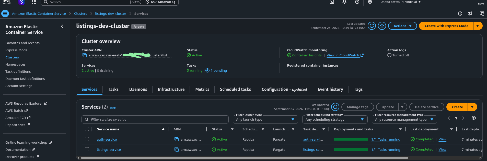
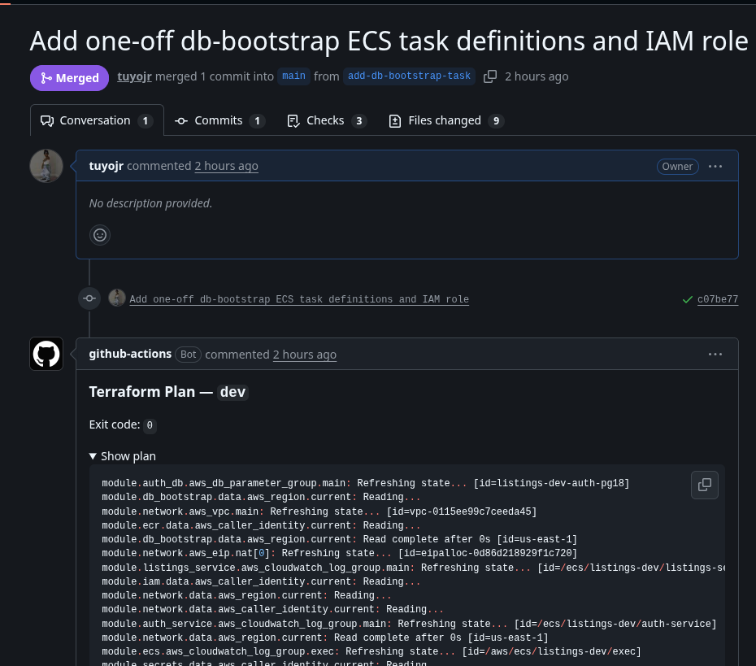
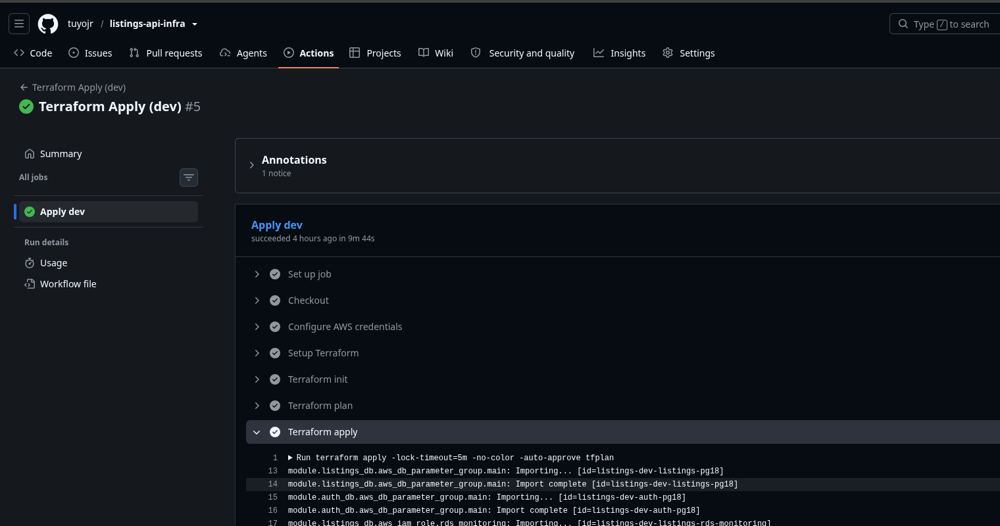
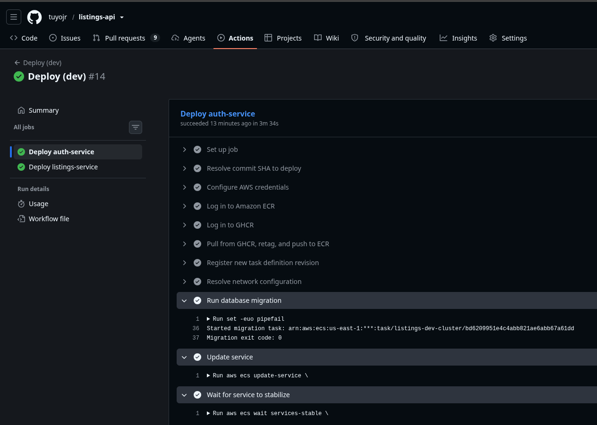
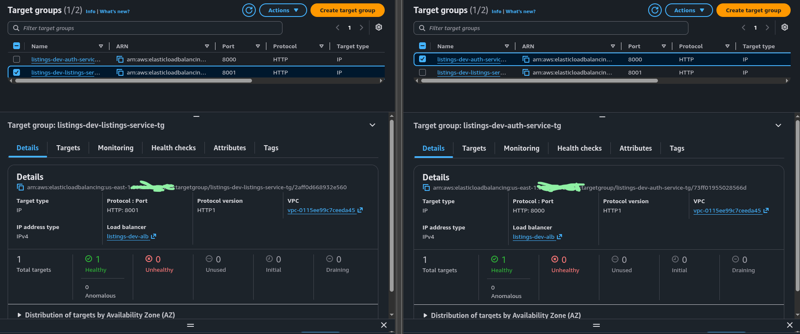
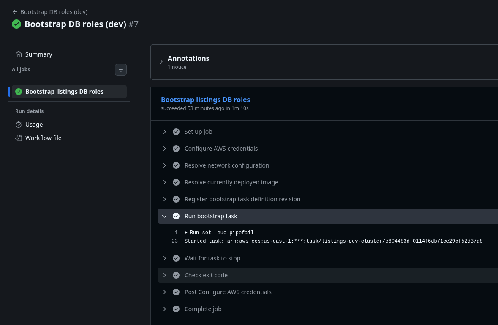
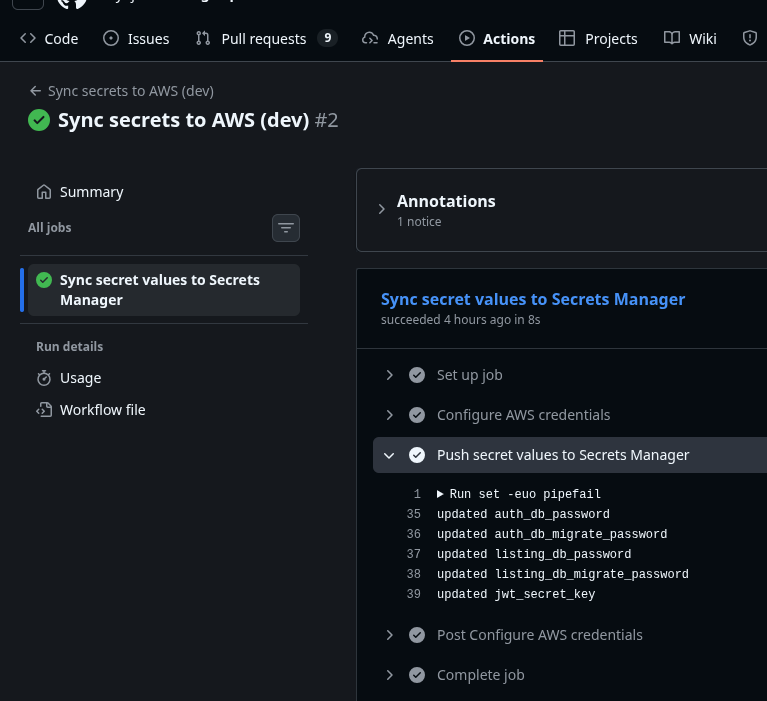

# listings-api-infra

Terraform + GitHub Actions for the AWS infrastructure behind [listings-api](https://github.com/tuyojr/listings-api) (auth-service + listings-service on ECS Fargate). Dev serves as prod for the purposes of conceptualizing what we're trying to achieve.

## What's here

- `environments/{dev,prod}/` - per-environment Terraform roots. Each wires the modules below into one VPC, one ECS cluster, two RDS instances, one ALB.
- `modules/` - reusable building blocks (network, database, ecr, ecs-cluster, iam, service, db_bootstrap, alb, secrets). See `modules/README.md` for what each one creates. I deally, these should be in their own repos, so they can be versioned and used accordingly with more dynamic configurations.
- `bootstrap/` - one-time per-account setup (state bucket, OIDC provider, IAM roles). See [bootstrap/README.md](./bootstrap/README.md).
- `.github/workflows/` - this repo's own Terraform CI/CD (plan on PR, apply on merge to main).

## Architecture

One VPC per environment, public + private subnets across two AZs, NAT gateway plus VPC interface endpoints (ECR, Secrets Manager, CloudWatch Logs, KMS, STS) so ECS tasks in the private subnets never need a public IP. An ALB in the public subnets terminates traffic and path-routes to two ECS services:

- `/auth/*` -> [auth-service](https://github.com/tuyojr/listings-api/tree/main/services/auth)
- `/api/*` -> [listings-service](https://github.com/tuyojr/listings-api/tree/main/services/listings)

Each service is its own ECS Fargate task, its own RDS Postgres instance (this might be a lot from a cost perspective, considering we can have multiple tables in the same DB to handle this. However, this is just to conceptualize what we need to achieve on a long term and isolate as much as possible), and its own IAM task role scoped to only the Secrets Manager entries it owns. Nothing reads another service's secrets, and the always-on task roles can't read the RDS master password either - only a dedicated one-off task role can, and only for the one-time role bootstrap (see below).



## How this repo and the app repo fit together

This repo owns the AWS side: VPC, RDS, ECS cluster, ALB, ECR repos, Secrets Manager containers, and the IAM roles the [app repo](https://github.com/tuyojr/listings-api)'s GitHub Actions assume. The [app repo](https://github.com/tuyojr/listings-api) owns the application side: the FastAPI services, their Dockerfiles, and the workflows that build, scan, and deploy them.

The connection point is IAM. [bootstrap/bootstrap.sh](./bootstrap/bootstrap.sh) creates an `app-deploy-dev` role, scoped to exactly what the app repo's workflows need, push to the two ECR repos, register new task definition revisions, run one-off migration/bootstrap tasks, update the two services, and that's all. The [app repo](https://github.com/tuyojr/listings-api)'s workflows assume this role via GitHub OIDC, no long-lived AWS credentials stored anywhere.

Secret [values are set by the app repo](https://github.com/tuyojr/listings-api/blob/main/.github/workflows/sync-secrets-dev.yml#L38-L43). Terraform creates empty Secrets Manager containers ([modules/secrets](./modules/secrets/)) with names the app already expects (`auth_db_password`, `jwt_secret_key`, and so on); the app repo's [sync-secrets-dev.yml](https://github.com/tuyojr/listings-api/blob/main/.github/workflows/sync-secrets-dev.yml) workflow pushes the actual values in, since the app's developers are the ones who know what those values should be, I believe, except in rare cases.

## Terraform workflow

Changes to this repo go through a PR. [terraform-plan.yml](./.github/workflows/terraform-plan.yml) runs on every PR and posts the plan. Merging to `main` triggers [terraform-apply-dev.yml](./.github/workflows/terraform-apply-dev.yml), which runs the real apply. Terraform is never run locally, only through these two workflows, using the `terraform-plan` and `terraform-apply-dev` OIDC roles from [bootstrap](./bootstrap/bootstrap.sh).

```TEXT
PR opened -> Terraform Plan (comments the diff) -> review -> merge -> Terraform Apply (dev)
```




## App deployment workflow

Pushing to `main` in the app repo runs its [CI](https://github.com/tuyojr/listings-api/actions/workflows/ci.yml) workflow: path-filtered lint/security/build/scan per service, image pushed to GHCR if it's a real push (not a PR). Once CI succeeds, [deploy-dev.yml](https://github.com/tuyojr/listings-api/actions/workflows/deploy-dev.yml) picks up automatically:

```TEXT
CI (build, scan, push to GHCR)
  -> pull image from GHCR, retag, push to ECR
  -> register a new task definition revision pointing at that image
  -> run alembic upgrade head as a one-off task using that same revision
  -> update the ECS service to the new revision (only if the migration succeeded)
  -> wait for the service to stabilize
```

Migrations run before the service is updated on purpose - a broken migration blocks the deploy instead of a new revision rolling out against a schema it doesn't match. Terraform ignores `container_definitions` and `task_definition` on the service after the first apply specifically so this workflow can register new revisions without a later `terraform apply` reverting them.




## One-off operational tasks

**New database, first time only.** RDS has no equivalent of Postgres's docker-entrypoint-initdb.d, so the app-level roles (`auth_rw`, `auth_migrate`, and so on) don't exist until [db-bootstrap.yml](https://github.com/tuyojr/listings-api/actions/workflows/db-bootstrap.yml) is run once per environment from the app repo's Actions tab. It runs [scripts/bootstrap_db_roles.py](https://github.com/tuyojr/listings-api/blob/main/scripts/bootstrap_db_roles.py) as a one-off Fargate task using a dedicated IAM role that can read the RDS master secret. This is the only role in the whole setup that can.



**Rotating a secret.** Set the new value in the app repo's `dev` environment secrets, then run [sync-secrets-dev.yml](https://github.com/tuyojr/listings-api/blob/main/.github/workflows/sync-secrets-dev.yml) to push it to Secrets Manager. Running ECS tasks read their secret once at startup, so a rotated value needs a fresh deployment to actually take effect.


