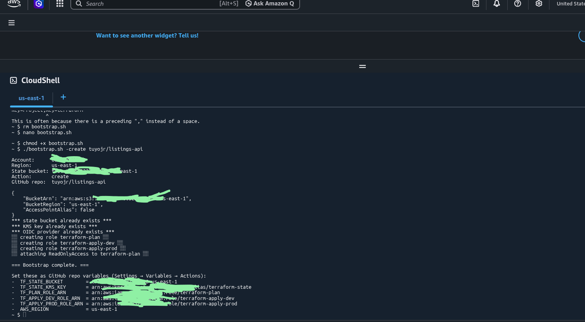
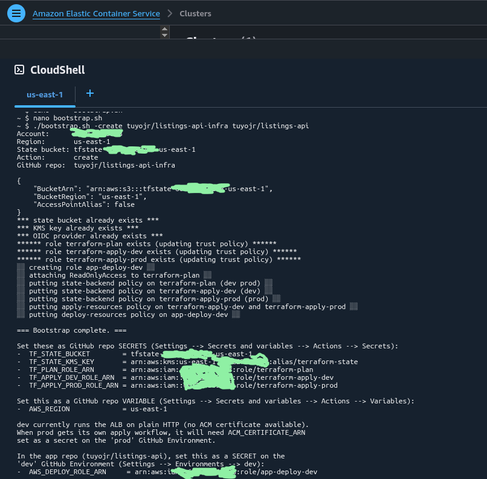
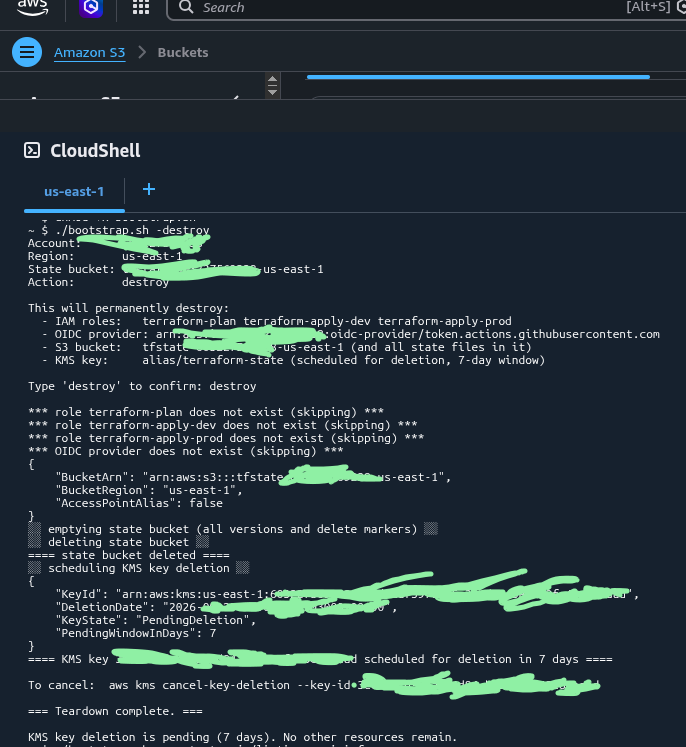

# Bootstrap

This is used for a one-time setup on each AWS account. It ccreates:

1. S3 bucket for Terraform state
2. KMS key for state encryption
3. GitHub OIDC provider
4. Three IAM roles assumable from GitHub Actions:
    - terraform-plan        (any PR)
    - terraform-apply-dev   (environment: dev)
    - terraform-apply-prod  (environment: prod)

## Prerequisites

- AWS account with admin access
- Access to AWS CloudShell (or an equivalent environment with admin credentials)

**Do not run this from a laptop.** CloudShell provides admin credentials in the browser session; running from a workstation encourages storing long-lived credentials locally.

## Usage

```bash
# Old method of creating bootstrap resources
bash bootstrap/bootstrap.sh -create <github-username>/<repo>
```



```bash
# New method of creating bootstrap resources, with app role included
bash bootstrap/bootstrap.sh -create <github-username>/<infra-repo> <github-username>/<app-repo>
```



```bash
# Tear everything down
bash bootstrap/bootstrap.sh -destroy
```


